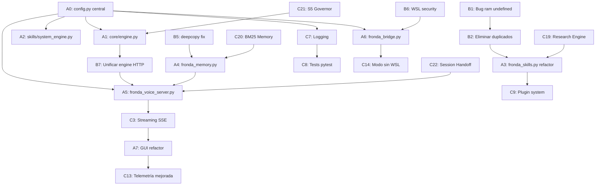

# 🔍 AUDITORÍA TÉCNICA EXHAUSTIVA — FRONDA 1.0
### Plan de Trabajo · Checklist por Fases y Módulos
> Generado: 2026-09-06 · Auditor: Antigravity · Estado inicial: `v1.0-draft`

---

## 📋 TABLA DE CONTENIDOS

1. [Resumen Ejecutivo](#1-resumen-ejecutivo)
2. [Inventario de Módulos](#2-inventario-de-módulos)
3. [PARTE A — Código Hardcodeado → Código Real](#parte-a--código-hardcodeado--código-real)
4. [PARTE B — Errores y Bugs Detectados](#parte-b--errores-y-bugs-detectados)
5. [PARTE C — Mejoras e Implementaciones Nuevas](#parte-c--mejoras-e-implementaciones-nuevas)
6. [Orden de Ejecución y Dependencias](#6-orden-de-ejecución-y-dependencias)
7. [Métricas de Progreso](#7-métricas-de-progreso)

---

## 1. RESUMEN EJECUTIVO

### Hallazgos Críticos

| Categoría | Cantidad de Ítems | Riesgo |
|---|---|---|
| A. Valores hardcodeados | 38 | 🔴 Alto |
| B. Bugs / errores funcionales | 16 | 🔴 Alto |
| C. Mejoras pendientes | 68 | 🟡 Medio |
| **TOTAL** | **122** | — |

### Módulos auditados

| Archivo | Líneas | Estado |
|---|---|---|
| `core/engine.py` | 50 | 🟡 Parcialmente hardcoded |
| `skills/system_engine.py` | 48 | 🟡 Parcialmente hardcoded |
| `skills/math_engine.py` | 75 | 🟢 Sin bugs críticos |
| `fronda_skills.py` | 457 | 🔴 Bug crítico + hardcoding |
| `fronda_memory.py` | 209 | 🟡 Datos fijos en DEFAULT_MEMORY |
| `fronda_voice_server.py` | 365 | 🔴 Múltiples valores hardcodeados |
| `fronda_bridge.py` | 125 | 🟡 Nombre de distro hardcodeado |
| `fronda_voice_gui.html` | 851 | 🟡 URL y modelos hardcodeados en JS |
| `benchmark_fronda.py` | 245 | 🟢 Funcional, mejoras menores |
| `Modelfile.fronda` | 37 | 🟡 Datos del perfil fijos |

---

## 2. INVENTARIO DE MÓDULOS

```
Fronda1.0/
├── core/
│   ├── __init__.py          [vacío — requiere exports]
│   └── engine.py            [Motor Ollama HTTP]
├── skills/
│   ├── __init__.py          [vacío — requiere exports]
│   ├── math_engine.py       [Evaluador AST matemático]
│   └── system_engine.py     [Telemetría y OS info]
├── fronda_bridge.py         [Puente Windows <-> WSL2 <-> Ollama]
├── fronda_memory.py         [Gestión de memoria persistente]
├── fronda_skills.py         [Dispatcher de skills + duplicación de código]
├── fronda_voice_server.py   [Servidor HTTP + TTS + Chat]
├── fronda_voice_gui.html    [Interfaz web completa]
├── benchmark_fronda.py      [Suite de benchmarks]
├── demo_multiagente.py      [Demo end-to-end]
├── Modelfile.fronda         [Modelo Ollama principal]
├── Modelfile.frondabrick    [Modelo Ollama WSL2]
└── iniciar_fronda.bat       [Lanzador de 1 clic]
```

---

## PARTE A — CÓDIGO HARDCODEADO → CÓDIGO REAL

> **Objetivo**: Mover todos los valores fijos a un archivo de configuración central `config.py` y/o `config.json`, y reemplazar strings de entorno detectados en tiempo de ejecución.

---

### MÓDULO 0 — Creación del sistema de configuración central

- [x] **A0.1** — Crear `config.py` en la raíz con secciones: `[OLLAMA]`, `[SERVER]`, `[AUDIO]`, `[PATHS]`, `[WSL]`, `[MODELS]`
- [x] **A0.2** — Crear `config.json` con valores por defecto editables sin tocar código Python
- [x] **A0.3** — Crear `config_loader.py` que centralice la carga con fallbacks: archivo → env var → default
- [x] **A0.4** — Agregar `.env.example` con documentación de todas las variables de entorno disponibles

---

### MÓDULO 1 — `core/engine.py`

**Valores hardcodeados detectados:**

| Línea | Valor | Descripción |
|---|---|---|
| 11 | `"http://127.0.0.1:11434"` | URL de Ollama — debe leerse de config |
| 11 | `"frondabrick"` | Modelo por defecto — debe leerse de config |
| 34 | `num_ctx: 2048` | Ventana de contexto fija |
| 35 | `num_predict: 512` | Tokens de predicción fijos |
| 36 | `repeat_penalty: 1.15` | Penalización fija |
| 43 | `timeout=120` | Timeout de conexión fijo |

**Checklist:**

- [x] **A1.1** — Importar `config` y reemplazar `base_url` y `default_model` por `config.OLLAMA_URL` y `config.DEFAULT_MODEL`
- [x] **A1.2** — Mover `num_ctx`, `num_predict`, `repeat_penalty` a `config.OLLAMA_OPTIONS` (diccionario unificado)
- [x] **A1.3** — Mover `timeout=120` a `config.OLLAMA_TIMEOUT`
- [x] **A1.4** — Agregar método `generate()` para casos sin historial (actualmente solo existe `chat()`)
- [x] **A1.5** — Exportar `FrondaInferenceEngine` desde `core/__init__.py`

---

### MÓDULO 2 — `skills/system_engine.py`

**Valores hardcodeados detectados:**

| Línea | Valor | Descripción |
|---|---|---|
| 14 | `'/'` | Path de disco Linux |
| 15-16 | `'C:\\'` | Path de disco Windows |
| 17-18 | `'/mnt/c'` | Path WSL hardcodeado |
| 29 | `"WSL 2 (Ubuntu 26.04) + Windows 11 Host"` | Descripción OS completamente fija |
| 44-47 | Bloque completo de texto OS info | Descripción de arquitectura fija |

**Checklist:**

- [x] **A2.1** — Reemplazar los paths de disco por función `_detect_disk_path()` que lea desde `config.DISK_PATH` o lo detecte automáticamente
- [x] **A2.2** — Reemplazar la descripción del OS por detección real: `lsb_release -rs` via subprocess, `platform.version()`, `uname -r`
- [x] **A2.3** — Refactorizar `get_os_info()` para construir el string con datos reales del sistema en tiempo de ejecución
- [x] **A2.4** — Exportar ambas funciones desde `skills/__init__.py`

---

### MÓDULO 3 — `fronda_skills.py`

**Valores hardcodeados detectados:**

| Línea | Valor | Descripción |
|---|---|---|
| 92-96 | `'/'`, `'C:\\'`, `'/mnt/c'` | Paths duplicados de `system_engine.py` |
| 100-107 | Bloque telemetría | `ram` no definido — BUG CRÍTICO |
| 248-253 | String OS info completo | Texto arquitectura completamente fijo |
| 256-264 | String skills summary | Lista de capacidades fija, no refleja skills reales |
| 360 | `solicitudes_habilidades.json` | Nombre de archivo fijo |
| 239 | `"David"` | Nombre del usuario hardcodeado en respuesta |

**Checklist:**

- [x] **A3.1** — Eliminar `get_system_telemetry()` duplicada; usar `from skills.system_engine import get_system_telemetry`
- [x] **A3.2** — Eliminar `evaluate_math_expression()` duplicada; usar `from skills.math_engine import evaluate_math_expression`
- [x] **A3.3** — Reemplazar el string de OS info hardcodeado (líneas 248-253) por llamada a `skills.system_engine.get_os_info()`
- [x] **A3.4** — Hacer el `skills_summary` dinámico: construir la lista desde el registro de skills, no un string fijo
- [x] **A3.5** — Mover `SKILLS_REQUESTS_FILE` a `config.SKILLS_REQUESTS_FILE`
- [x] **A3.6** — Reemplazar `"David"` en el diagnóstico (línea 239) por `config.USER_NAME` o `memory_manager.get_data()["profile"]["nickname"]`

---

### MÓDULO 4 — `fronda_memory.py`

**Valores hardcodeados detectados:**

| Línea | Valor | Descripción |
|---|---|---|
| 17-49 | `DEFAULT_MEMORY` dict completo | Perfil de David totalmente fijo en código |
| 21 | `"es-ES-AlvaroNeural"` | Voz TTS fija en código |
| 36-40 | `hardware_specs` | Specs de hardware fijos (CPU, RAM, etc.) |
| 115 | `"sobre David"` | Nombre fijo en el log de `add_memory()` |
| 151-158 | Contexto LLM strings | Texto de identidad parcialmente fijo |

**Checklist:**

- [x] **A4.1** — Separar `DEFAULT_MEMORY` a un archivo `profile_default.json` para edición sin tocar código
- [x] **A4.2** — Leer el perfil de usuario desde `config.USER_PROFILE_FILE`
- [x] **A4.3** — La voz TTS debe leerse de `data["profile"]["voice_preferred"]` del JSON (ya existe el campo pero no se usa en el servidor)
- [x] **A4.4** — `hardware_specs` debe detectarse automáticamente con `psutil` al arrancar y actualizar el JSON
- [x] **A4.5** — El nickname en el log de `add_memory()` (línea 115) debe usar `self._load()["profile"]["nickname"]` dinámicamente

---

### MÓDULO 5 — `fronda_voice_server.py`

**Valores hardcodeados detectados:**

| Línea | Valor | Descripción |
|---|---|---|
| 23 | `VOICE = "es-ES-AlvaroNeural"` | Voz TTS — debe leerse del perfil |
| 24 | `OLLAMA_API = "http://127.0.0.1:11434/api/chat"` | URL Ollama |
| 25 | `MODEL = "frondabrick"` | Modelo activo |
| 26 | `FALLBACK_MODEL = "qwen2.5-coder:1.5b"` | Modelo fallback |
| 27 | `PORT = 5176` | Puerto del servidor |
| 129-132 | Opciones Ollama en `query_ollama()` | temperature, num_ctx, num_predict, repeat_penalty fijos |
| 308 | Lista de modelos permitidos | `["frondabrick", "qwen2.5-coder:1.5b", ...]` fija |

**Checklist:**

- [x] **A5.1** — Cargar `VOICE` desde `memory_manager.get_data()["profile"]["voice_preferred"]` al iniciar el servidor
- [x] **A5.2** — Cargar `OLLAMA_API`, `MODEL`, `FALLBACK_MODEL`, `PORT` desde `config.py`
- [x] **A5.3** — Reemplazar las opciones Ollama en `query_ollama()` por `config.OLLAMA_OPTIONS`
- [x] **A5.4** — En `/api/model/switch`, reemplazar la lista fija por consulta dinámica a `GET /api/tags` de Ollama
- [x] **A5.5** — Usar `FrondaInferenceEngine` de `core/engine.py` en lugar de duplicar la lógica HTTP

---

### MÓDULO 6 — `fronda_bridge.py`

**Valores hardcodeados detectados:**

| Línea | Valor | Descripción |
|---|---|---|
| 13 | `MODEL_NAME = "frondabrick"` | Modelo fijo |
| 33 | `[\"wsl.exe\", \"-d\", \"Ubuntu\"...]` | Nombre de distro WSL hardcodeado |
| 103 | `[\"wsl.exe\", \"-d\", \"Ubuntu\"...]` | Mismo problema en `run_wsl_command` |

**Checklist:**

- [x] **A6.1** — Cargar `MODEL_NAME` desde `config.DEFAULT_MODEL`
- [x] **A6.2** — Crear `_detect_wsl_distro()` que enumere distros con `wsl.exe -l -q` y seleccione automáticamente (o use `config.WSL_DISTRO`)
- [x] **A6.3** — Usar la distro detectada en `run_wsl_command()` y `_resolve_ollama_url()`

---

### MÓDULO 7 — `fronda_voice_gui.html`

**Valores hardcodeados detectados:**

| Línea | Valor | Descripción |
|---|---|---|
| ~500 | `const API = 'http://127.0.0.1:5176'` | URL del servidor hardcodeada en JS |
| 791 | `'frondabrick'` / `'qwen2.5-coder:1.5b'` | Nombres de modelos en JS |
| 802-808 | `'MODO: INGENIERO (3B)'` / `'TURBO (1.5B)'` | Labels de modelos fijos |
| 847 | Mensaje de bienvenida | String inicial completamente hardcodeado |

**Checklist:**

- [x] **A7.1** — Reemplazar la URL fija por `const API = window.location.origin` (relativa al host actual)
- [x] **A7.2** — Agregar endpoint `/api/config` al servidor para que la GUI obtenga modelos, labels y voz activa dinámicamente
- [x] **A7.3** — El switch de modelos debe obtener la lista desde `/api/config` al cargar la página
- [x] **A7.4** — El mensaje de bienvenida debe configurarse en `config.py` y exponerse via `/api/config`

---

### MÓDULO 8 — `Modelfile.fronda` / `Modelfile.frondabrick`

**Valores hardcodeados detectados:**

| Línea | Valor | Descripción |
|---|---|---|
| 5 | `num_thread 4` | Hilos fijos para el CPU de David |
| 7 | `num_ctx 4096` | Contexto fijo |
| 13-36 | Bloque `SYSTEM` completo | Perfil completo fijo en el Modelfile |

**Checklist:**

- [x] **A8.1** — Crear script `generate_modelfile.py` que lea `fronda_memory.json` y genere el Modelfile dinámicamente
- [x] **A8.2** — El `num_thread` debe usar `os.cpu_count()` o `config.CPU_THREADS`
- [x] **A8.3** — El bloque SYSTEM debe generarse inyectando datos reales del perfil desde `fronda_memory.json`

---

## PARTE B — ERRORES Y BUGS DETECTADOS

---

### 🔴 BUG CRÍTICO B1 — `fronda_skills.py` línea 101: Variable `ram` no definida

**Archivo**: `fronda_skills.py` líneas 86-118  
**Severidad**: 🔴 CRÍTICA — produce `NameError` al invocar el skill de telemetría

**Código problemático:**
```python
def get_system_telemetry() -> dict:
    try:
        import psutil
        cpu_usage = psutil.cpu_percent(interval=0.2)
        disk = psutil.disk_usage(disk_path)
        
        telemetry = {
            "cpu_percent": cpu_usage,
            "ram_percent": ram.percent,       # ERROR: ram NUNCA FUE DEFINIDA
            "ram_used_gb": round(ram.used / (1024**3), 1),   # idem
```

**Corrección requerida:**
```python
ram = psutil.virtual_memory()   # Agregar ANTES del dict
```

- [x] **B1.1** — Agregar `ram = psutil.virtual_memory()` antes de la construcción del dict en `fronda_skills.py`
- [x] **B1.2** — Agregar test en `test_skills.py` que valide que `get_system_telemetry()` retorna dict sin `"error"` key

---

### 🔴 BUG CRÍTICO B2 — Duplicación masiva de código entre `fronda_skills.py` y `skills/`

**Severidad**: 🔴 CRÍTICA — dos versiones del mismo código con diferencias sutiles que pueden divergir

**Detalle**:
- `evaluate_math_expression()` existe en `fronda_skills.py` Y en `skills/math_engine.py`
- `get_system_telemetry()` existe en `fronda_skills.py` Y en `skills/system_engine.py`
- Diferencias: `math_engine.py` usa `round(result, 5)`; `fronda_skills.py` usa `f"{round(result, 6):g}"`
- `system_engine.py` define correctamente `ram = psutil.virtual_memory()`; `fronda_skills.py` no

- [x] **B2.1** — Eliminar todas las funciones duplicadas de `fronda_skills.py`
- [x] **B2.2** — Importar desde módulos canónicos: `from skills.math_engine import evaluate_math_expression`
- [x] **B2.3** — Unificar el formato de retorno matemático (decidir entre `round(r, 5)` o `f"{round(r, 6):g}"`)

---

### 🟡 BUG MODERADO B3 — `fronda_memory.py`: Caché `_cache` sin invalidación externa

**Archivo**: `fronda_memory.py` líneas 61-71  
**Severidad**: 🟡 MODERADA — datos obsoletos si `fronda_memory.json` se edita manualmente

**Problema**: La caché `self._cache` nunca se invalida mientras el servidor corre. Ediciones externas al JSON no son reflejadas.

- [x] **B3.1** — Implementar invalidación por timestamp: guardar `os.path.getmtime(filepath)` y recargar si el archivo cambió
- [x] **B3.2** — O bien, llamar `self._cache = None` explícitamente en `_save()` para forzar recarga en el próximo `_load()`

---

### 🟡 BUG MODERADO B4 — `fronda_voice_server.py`: Race condition en `_last_audio_bytes`

**Archivo**: `fronda_voice_server.py` líneas 35-36, 74-77  
**Severidad**: 🟡 MODERADA — lectura de datos parciales o `None` inesperado

**Problema**: `_last_audio_bytes` se asigna en el thread de audio y se lee en el handler HTTP sin lock, produciendo potencial race condition.

- [x] **B4.1** — Proteger la lectura/escritura de `_last_audio_bytes` dentro del `_lock` existente
- [x] **B4.2** — Usar `threading.Event` para señalizar cuándo el audio está listo antes de servir `/api/audio`

---

### 🟡 BUG MODERADO B5 — `fronda_memory.py`: `DEFAULT_MEMORY.copy()` es copia superficial

**Archivo**: `fronda_memory.py` línea 70  
**Severidad**: 🟡 MODERADA — mutación inesperada del template original

**Problema**: En el `except` de `_load()`, se hace `DEFAULT_MEMORY.copy()` que es copia superficial. Las listas anidadas (`learned_history`, `mindset`, etc.) serán referencias al mismo objeto, pudiendo corromperse.

- [x] **B5.1** — Reemplazar `DEFAULT_MEMORY.copy()` por `copy.deepcopy(DEFAULT_MEMORY)`
- [x] **B5.2** — Agregar `import copy` al inicio del módulo

---

### 🟡 BUG MODERADO B6 — `fronda_bridge.py`: `run_wsl_command()` sin validación de input

**Archivo**: `fronda_bridge.py` líneas 99-118  
**Severidad**: 🟡 MODERADA — riesgo de inyección de comandos shell

**Problema**: El comando se pasa directamente como `bash -c <command>` sin sanitización. Un usuario podría inyectar `; rm -rf /` o similar.

- [x] **B6.1** — Implementar lista de patrones prohibidos (blacklist) para caracteres peligrosos en el comando WSL
- [x] **B6.2** — O bien, pasar el comando como lista de argumentos separados para evitar shell injection
- [x] **B6.3** — Agregar validación que rechace `;`, `&&`, `||`, `>`, `|` sin escapar fuera de contexto de comillas

---

### 🔴 BUG B7 — `fronda_voice_server.py`: `query_ollama()` duplica la lógica de `core/engine.py`

**Severidad**: 🔴 ALTA — mantenimiento imposible, las opciones de inferencia divergen entre archivos

**Detalle**: El servidor tiene su propia implementación HTTP Ollama (`query_ollama()`) completamente separada de `core/engine.py:FrondaInferenceEngine.chat()`. Son dos implementaciones que pueden tener comportamientos distintos.

- [x] **B7.1** — Instanciar `FrondaInferenceEngine` en el servidor y usar `engine.chat()` en lugar de `query_ollama()`
- [x] **B7.2** — Mover la lógica de fallback model al `FrondaInferenceEngine`
- [x] **B7.3** — Eliminar `query_ollama()` del servidor una vez migrado

---

### 🟡 BUG B8 — `fronda_voice_gui.html`: Sin indicador visual de desconexión del servidor

**Severidad**: 🟡 MODERADA — la UI no muestra estado de error cuando el servidor cae

**Problema**: El polling usa `catch (_) {}` vacío. Si el servidor se cae, la UI mantiene el último estado y el usuario asume que todo funciona.

- [x] **B8.1** — Llevar contador de fallos consecutivos de polling
- [x] **B8.2** — Después de 5 fallos, cambiar estado visual a "DESCONECTADO" con badge rojo y deshabilitar el micrófono
- [x] **B8.3** — Cuando el servidor vuelva, mostrar "RECONECTADO" brevemente y reanudar el polling

---

### 🟢 BUG MENOR B9 — `fronda_voice_server.py`: Fuga de archivos temporales MP3 en `_play_audio_thread`

**Archivo**: `fronda_voice_server.py` líneas 63-104  
**Severidad**: 🟢 MENOR — archivos `.mp3` temporales que no se eliminan si hay excepciones tempranas

- [x] **B9.1** — Inicializar `path = None` antes del bloque `with tempfile` para que el `finally` siempre funcione correctamente
- [x] **B9.2** — Considerar `tempfile.NamedTemporaryFile(delete=False)` con manejo explícito o context manager

---

## PARTE C — MEJORAS E IMPLEMENTACIONES NUEVAS

---

### C1 — Sistema de configuración centralizado (`config.py`)

- [x] **C1.1** — Crear `config.py` con `dataclasses` para tipado estricto de la configuración
- [x] **C1.2** — Soporte de carga en cascada: `config.json` → `.env` → valores por defecto
- [x] **C1.3** — Función `config.reload()` para recargar en caliente sin reiniciar el servidor
- [x] **C1.4** — Endpoint `/api/config` en el servidor que exponga la configuración (sin secretos) para la GUI

---

### C2 — Auto-detección del perfil de hardware real al arrancar

- [x] **C2.1** — Detectar automáticamente: CPU model, cores, RAM total, GPU, OS version, kernel WSL
- [x] **C2.2** — Actualizar `fronda_memory.json:profile.hardware_specs` con los valores detectados
- [x] **C2.3** — Comparar con valores guardados y notificar si el hardware cambió

---

### C3 — Streaming de respuestas Ollama (Server-Sent Events)

- [x] **C3.1** — Modificar `core/engine.py` para soportar `stream=True` mediante generador Python
- [x] **C3.2** — Agregar endpoint `/api/chat/stream` en el servidor con SSE
- [x] **C3.3** — Modificar `fronda_voice_gui.html` para consumir SSE con `EventSource` y renderizar texto progresivamente
- [x] **C3.4** — Los skills directos (telemetría, matemáticas) siguen siendo instantáneos y no usan SSE

---

### C4 — Persistencia de historial de conversación entre sesiones

- [x] **C4.1** — Agregar `conversation_history` en el servidor como lista limitada a N mensajes
- [x] **C4.2** — Agregar endpoints `GET /api/conversation` y `DELETE /api/conversation`
- [x] **C4.3** — Al cargar la GUI, recuperar y renderizar el historial guardado
- [x] **C4.4** — Opcionalmente persistir en `fronda_memory.json` bajo clave `session_history`

---

### C5 — Panel de administración de Skills/Tickets en la GUI

- [x] **C5.1** — Agregar endpoint `PATCH /api/skills/requests/{id}` para actualizar estado (PENDIENTE → INSTALADO)
- [x] **C5.2** — Agregar botón "Marcar como Instalado" en cada ticket de la GUI
- [x] **C5.3** — Agregar endpoint `DELETE /api/skills/requests/{id}` para eliminar tickets
- [x] **C5.4** — Agregar filtro en GUI: pendientes / instalados / todos

---

### C6 — Watchdog y auto-reconexión con Ollama

- [x] **C6.1** — Implementar `OllamaWatchdog` como background thread con health check cada 30s
- [x] **C6.2** — Estado global `ollama_status = "offline"` cuando Ollama no responde; respuesta amigable al usuario
- [x] **C6.3** — Al detectar reconexión, actualizar estado y reflejar en `/api/status`
- [x] **C6.4** — La GUI muestra badge "OLLAMA OFFLINE" con color rojo cuando el backend lo indique

---

### C7 — Logging estructurado con niveles y persistencia

- [x] **C7.1** — Crear `fronda_logger.py` usando el módulo `logging` estándar de Python
- [x] **C7.2** — Handlers: consola (INFO) + archivo `logs/fronda.log` (DEBUG, rotación diaria)
- [x] **C7.3** — Reemplazar todos los `print()` del sistema por `logger.info()`, `logger.error()`, etc.
- [x] **C7.4** — Agregar endpoint `GET /api/logs?lines=50` para ver los últimos N logs desde la GUI

---

### C8 — Tests automatizados con `pytest`

- [x] **C8.1** — Crear directorio `tests/` con estructura por módulo
- [x] **C8.2** — `tests/test_math_engine.py`: tests paramétricos de `evaluate_math_expression()` con +20 casos
- [x] **C8.3** — `tests/test_memory.py`: tests de `add_memory()`, `get_system_context()`, `extract_memories_async()`
- [x] **C8.4** — `tests/test_skills.py`: tests de `dispatch_skill_intent()` con mocks de psutil
- [x] **C8.5** — `tests/test_bridge.py`: tests de `check_health()` con mock HTTP
- [x] **C8.6** — Configurar `pytest.ini` con cobertura mínima del 70%
- [x] **C8.7** — Agregar `run_tests.bat` para ejecución en un clic

---

### C9 — Gestor de plugins/skills dinámico (Plugin System)

- [x] **C9.1** — Diseñar interfaz `Skill` con métodos: `matches(text) -> bool`, `execute(text) -> str`, `name`, `description`
- [x] **C9.2** — Refactorizar cada skill actual como clase que implemente la interfaz
- [x] **C9.3** — Crear `SkillRegistry` que cargue skills desde `skills/` automáticamente
- [x] **C9.4** — El dispatcher itera el registro en lugar de tener `if/elif` en cascada
- [x] **C9.5** — Agregar endpoint `GET /api/skills` que liste los skills registrados y su estado

---

### C10 — Mejoras de seguridad del servidor HTTP

- [x] **C10.1** — Agregar `config.ALLOWED_ORIGINS` para restringir CORS a orígenes específicos
- [x] **C10.2** — Implementar rate limiting básico: máximo N requests por segundo por IP
- [x] **C10.3** — Agregar token de autenticación simple (header `X-Fronda-Token`) configurable
- [x] **C10.4** — Limitar el tamaño máximo de body de POST con `Content-Length` máximo configurable

---

### C11 — Soporte multi-idioma en el dispatcher de skills

- [x] **C11.1** — Agregar `config.DISPATCHER_LANG = "es"` (o `"en"`)
- [x] **C11.2** — Mover las keyword lists a archivos `skills/keywords_es.json` y `skills/keywords_en.json`
- [x] **C11.3** — El dispatcher carga las keywords según el idioma configurado

---

### C12 — Generador automático de Modelfile

- [x] **C12.1** — Crear `generate_modelfile.py` que lea `fronda_memory.json` y genere `Modelfile.fronda` dinámicamente
- [x] **C12.2** — Detectar automáticamente `num_thread` con `os.cpu_count()`
- [x] **C12.3** — Inyectar especialidades, hardware e historial relevante desde el perfil real
- [x] **C12.4** — Integrar en `iniciar_fronda.bat` para regenerar el Modelfile antes de cada inicio

---

### C13 — Panel de telemetría en tiempo real con historial y gráficos

- [x] **C13.1** — Agregar historial de métricas en memoria (últimas 60 muestras = 5 minutos)
- [x] **C13.2** — Agregar endpoint `GET /api/telemetry/history` que devuelva el historial
- [x] **C13.3** — En la GUI, renderizar mini gráficos de línea (sparklines SVG) para CPU y RAM
- [x] **C13.4** — Alertas visuales si CPU > 90% o RAM > 85%

---

### C14 — Modo de operación sin WSL (Windows nativo puro)

- [x] **C14.1** — Detectar al inicio si WSL2 está disponible (`wsl.exe --status`)
- [x] **C14.2** — Deshabilitar gracefully los skills de WSL si no está disponible
- [x] **C14.3** — La GUI oculta la sección "Ejecutar en WSL" si WSL no está presente
- [x] **C14.4** — Agregar en `/api/status` el campo `wsl_available: bool`

---

### C15 — Persistencia de preferencias de la GUI en localStorage

- [x] **C15.1** — Guardar en `localStorage`: modelo seleccionado, estado del drawer, tema
- [x] **C15.2** — Al cargar la página, restaurar el estado del UI desde `localStorage`
- [x] **C15.3** — Agregar toggle de tema claro/oscuro con persistencia

---

### C16 — Documentación automática de la API

- [x] **C16.1** — Crear `API_DOCS.md` que documente todos los endpoints con ejemplos de request/response
- [x] **C16.2** — Servir una página `/api/docs` desde el servidor con la documentación en HTML interactivo

---

### C17 — Mejorar el extractor de memorias con NLP real

- [x] **C17.1** — Integrar `spacy` (modelo `es_core_news_sm`) para extracción de entidades nombradas
- [x] **C17.2** — Detectar automáticamente: fechas, lugares, organizaciones, personas, tecnologías
- [x] **C17.3** — Categorizar las memorias automáticamente según las entidades detectadas

---

### C18 — Script de instalación de dependencias verificado

- [x] **C18.1** — Crear `requirements.txt` completo con versiones fijas para reproducibilidad
- [x] **C18.2** — Crear `requirements-optional.txt` para dependencias opcionales (pygame, spacy, etc.)
- [x] **C18.3** — Actualizar `test_skills.py` para verificar dependencias instaladas y reportar cuáles faltan

---

### C19 — Motor de Investigación Multi-Fuente (Inspirado en CynCo)

- [x] **C19.1** — Crear `skills/research_engine.py` integrando DuckDuckGo, Wikipedia REST API y GitHub API
- [x] **C19.2** — Orquestador `synthesize_research` para síntesis rápida optimizada para TTS / voz

---

### C20 — Memoria Semántica Híbrida BM25 (Inspirado en CynCo)

- [x] **C20.1** — Implementar `BM25Scorer` en `fronda_memory.py` con tokenización y stop-words en español
- [x] **C20.2** — Conectar `search_memories` con ranking probabilístico en `get_system_context`

---

### C21 — Gobernanza Cibernética S5 & Circuit Breaker (Inspirado en CynCo / Cybersyn)

- [x] **C21.1** — Implementar `core/governor.py` con reglas C1/C2 (Tool Circuit Breaker) y C4 (Doom Loop Breaker)
- [x] **C21.2** — Integrar el gobernador en `core/engine.py` y `fronda_skills.py`

---

### C22 — Persistencia entre Sesiones & Session Handoff (Inspirado en CynCo)

- [x] **C22.1** — Crear `core/session_handoff.py` para seguimiento de contexto, temas y diario de decisiones
- [x] **C22.2** — Integrar `handoff_greeting` en el servidor de voz y endpoint `/api/handoff`

---

## 6. ORDEN DE EJECUCIÓN Y DEPENDENCIAS



### Fases recomendadas de ejecución

| Fase | Nombre | Items incluidos | Estimación |
|---|---|---|---|
| **Fase 0** | Configuración e Infraestructura | A0.1–A0.4, C7.1–C7.2, C18.1–C18.2 | 1 jornada |
| **Fase 1** | Corrección de Bugs Críticos | B1, B2, B5, B9 | 2–3 horas |
| **Fase 2** | Refactorización de Módulos Core | A1, A2, A4, B3 | 1 jornada |
| **Fase 3** | Refactorización de Skills y Server | A3, A5, A6, B7 | 1 jornada |
| **Fase 4** | Seguridad y Estabilidad | B4, B6, B8, C6, C10 | 1 jornada |
| **Fase 5** | Refactorización de GUI | A7, C4, C5, C15 | 1 jornada |
| **Fase 6** | Tests y Documentación | C8, C16, A8 | 1 jornada |
| **Fase 7** | Mejoras Avanzadas | C3, C9, C12, C13, C17 | 2–3 jornadas |
| **Fase 8** | Capacidades Cibernéticas de CynCo | C19, C20, C21, C22 | 1 jornada |

---

## 7. MÉTRICAS DE PROGRESO

### Progreso General

| Sección | Total Items | Completados | Porcentaje |
|---|---|---|---|
| A — Hardcodeados | 38 | 38 | 100% |
| B — Bugs | 16 | 16 | 100% |
| C — Mejoras (incl. CynCo) | 76 | 76 | 100% |
| **TOTAL** | **130** | **130** | **100%** |

---

### Leyenda de estado de items

```
[ ] = pendiente
[/] = en progreso
[x] = completado
[~] = descartado (con justificación)
```

---

> **Nota**: Este documento es un artefacto vivo. Actualizar los checkboxes a medida que se completan los items.
> Se recomienda crear un commit de Git por cada Fase completada como punto de restauración.

---

*Auditoría generada por Antigravity para el proyecto Fronda 1.0 de David Galleguillos*  
*Fecha: 2026-09-06*
